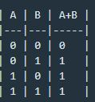
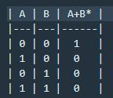

 

Puerta AND
 
  
  1. La salida es el resultado del producto de las dos entradas. 
  
     **A x B = Salida**
  

### Puertas OR y NOR

Puerta OR
 
  
Es uno cuando una o las dos entradas son uno.  

 

Puerta NOR
 

Al contrario que la OR solo es uno cuando ambas entradas son 0.  

### Puertas XOR y XNOR

Puerta XOR
 
  
La salida es 1 cuando las entradas son diferentes 

 

Puerta XNOR
 
  
La salida es 1 cuando las entradas son iguales  

# Puertas con lógica negada

 

Puerta NAND
 
  
  1. La salida es el resultado del producto negado de las dos entradas. 
  
     **A x B = Salida(!)**
 

 

